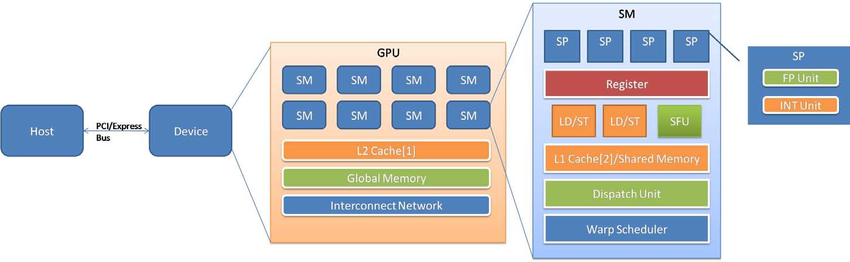
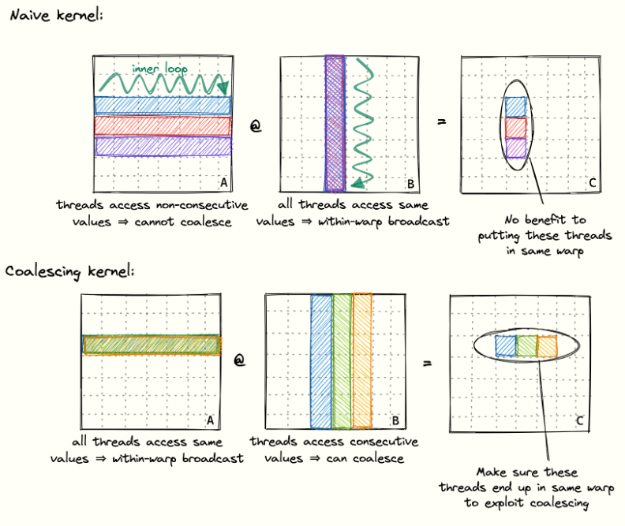
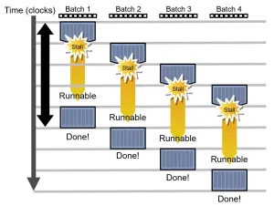

## CUDA SGEMM 커널 최적화 프로젝트 소개
SGEMM(Single-precision General Matrix Multiplication)은 딥러닝 모델의 학습과 추론 과정에서 가장 큰 비중을 차지하는 연산입니다. 대부분의 신경망 연산은 내부적으로 행렬 곱셈으로 변환되어 처리되므로, SGEMM의 성능은 곧 전체 시스템의 처리량(Throughput)과 직결됩니다.

행렬 곱셈은 연산 밀도가 높고 메모리 접근 패턴이 규칙적이기 때문에, CUDA 프로그래밍의 다양한 최적화 기법을 적용하고 그 효과를 실험하기에 가장 적합한 표준 벤치마크이기도 합니다. 본 글에서는 기본적인 커널 구현에서 시작하여, 하드웨어 성능을 한계치까지 끌어올리기 위해 다음과 같은 단계별 최적화 기법을 적용해 봅니다.

1. **Memory Coalescing**: 글로벌 메모리 접근 패턴을 정렬하여 대역폭 효율을 높이는 방법
2. **Shared Memory Tiling**: 데이터를 공유 메모리에 적재하여 글로벌 메모리 접근 횟수를 줄이는 전략
3. **Register Tiling**: 각 스레드가 처리하는 데이터 단위를 키워 공유 메모리 접근조차 최소화하는 기법
4. **Vectorized Access**: 128비트 로드/스토어 명령어를 사용하여 메모리 연산 횟수를 줄이는 최적화
5. **Warp Tiling**: 연산 단위를 워프(Warp) 수준으로 분할하여 계층적으로 성능을 높이는 구조

이 과정을 통해 단순한 코드 구현을 넘어, GPU의 메모리 계층 구조와 연산 유닛을 어떻게 하면 가장 효율적으로 사용할 수 있는지 소개합니다.


## NVIDIA GPU 하드웨어 구성
### 연산 구조

우리가 흔히 사용하는 CPU는 복잡한 제어 논리와 대용량 캐시를 통해 단일 스레드의 성능을 극대화하는데 초점이 맞춰져 있습니다. 반면 GPU는 수많은 스레드를 동시에 실행시키는 병렬 처리에 최적화된 구조를 갖추고 있습니다.

NVIDIA GPU의 기본 연산 단위는 **Streaming Multiprocessor (SM)** 입니다.

각 SM은 수많은 **CUDA Core (SP)** 로 구성되어 있으며, 각 SP는 실제로 산술 연산을 수행하는 단위입니다.

### 메모리 구조

NVIDIA GPU의 메모리 계층은 다음과 같이 3단계로 나뉩니다.

- **Global Memory(GMEM)**: 우리가 흔히 말하는 VRAM으로, GPU의 모든 스레드가 접근할 수 있는 가장 큰 메모리 공간이나 접근 속도는 가장 느립니다.
- **Shared Memory(SMEM)**: 같은 Block에 속한 스레드들이 함께 사용하는 on-chip 메모리입니다. 프로그래머가 직접 인덱스를 계산해 읽고 쓰는 일종의 **Software-managed cache** 역할을 합니다. GMEM에 비해 메모리 공간은 작지만 접근 속도는 훨씬 빠르다는 장점이 있습니다.
- **Register**: 각 Thread가 독점적으로 사용하는 가장 빠른 저장 공간으로, 연산 집약적으로 사용되는 변수들이 주로 여기에 매핑됩니다. CPU의 캐시처럼 자동으로 관리되는 것이 아니라, 컴파일러가 변수들을 레지스터에 배치한다는 점에서 **Compiler-managed cache** 역할을 합니다.

이 외에도 Shared Memory와 공간을 공유하는 **L1 캐시**, 모든 SM이 공유하는 **L2 캐시**가 있습니다.

정리하자면 메모리의 접근속도와 용량은 반비례 관계를 가집니다.

속도: Register > SMEM > GMEM  
용량: GMEM > SMEM > Register  

## CUDA Programming Model
CUDA 프로그래밍 모델은 계층적 병렬 실행 구조를 기반으로 합니다.  
연산은 크게 **Grid → Block → Thread**의 3계층으로 나누어집니다.  
(하드웨어적으로는 Block과 Thread 계층 사이에 Warp 계층이 존재하지만, CUDA 코드에는 직접 등장하지 않습니다.)

### Three-level of Computation Hierarchy


하나의 CUDA 커널은 하나의 Grid이며, Grid는 한 개 이상의 Block으로 구성됩니다. 각 Block은 다시 여러 Thread로 구성됩니다. 

이때 각 Block은 독립적 연산 단위로 각기 다른 SM에서 병렬로 실행될 수 있습니다. 이는 같은 Grid에 속한 Block들이 서로 다른 SM에서 동시에 실행될 수 있음을 의미하며, 다른 Block에 속한 Thread들은 SMEM을 공유하지 못한다는 뜻이기도 합니다. 만약 Block 수준의 협력이 필요하다면 느리지만 GMEM을 통해 데이터를 주고 받아야 합니다.

## CUDA Kernel Launch Example
아래는 간단한 Kernel 호출 예제입니다. 커널 호출 안에서 각 Thread는 자신이 속한 Block 좌표와 Thread 좌표를 출력합니다.
```cpp
#include <cuda_runtime.h>
#include <stdio.h>

__global__ void TestKernel() {
  // 간단한 커널 예제
  printf("Block ID: (%d, %d), Thread ID: (%d, %d)\n",
        blockIdx.x, blockIdx.y, threadIdx.x, threadIdx.y);
}

int main() {
    dim3 grid_dim(2, 2);
    dim3 block_dim(3, 3);

    TestKernel<<<grid_dim, block_dim>>>();
    cudaDeviceSynchronize();
    return 0;
}
```

## SGEMM 연산 소개
해당 튜토리얼에서는 SGEMM (Single Precision General Matrix Multiplication)을 다룹니다. SGEMM는 $C=\alpha \cdot A \cdot B + \beta \cdot C$ 를 기본형태로 갖습니다. 

여기서 A, B는 두 입력 행렬이고 C는 출력 행렬입니다. $\alpha$ 와 $\beta$ 는 단순히 행렬 전체에 곱해지는 scalar값입니다. 

### 연산 분석

이해를 돕기위해 두 A, B 행렬 모두 N by N 행렬이라고 가정합니다. 그럼 SGEMM가 연산되며 드는 연산량과 읽고 써야되는 아래와 같습니다.

Total FLOPS: $2\cdot N^{3} + N^{2} \approx 2\cdot N^{3}$  
Total data to read: $3 \cdot N^{2} \cdot \text{4 Byte} = 12 \cdot N^{2} \text{ Byte}$  
Total data to store: $N^{2} \cdot 4 \text{ Byte}$  

먼저 연산을 위해 드는 총 FLOPS는 다음과 같이 계산할 수 있습니다. 결과 행렬 C의 각 출력 원소마다 $2\cdot N+1$번의 실수연산이 필요합니다. 이러한 과정을 결과 행렬의 모든 원소에 대해 ($N^{2}$)에 확장하면 총 $2\cdot N^{3}+N^{2}$번의 FLOPS가 듭니다.

연산을 위해 읽어들이는 데이터 양은 행렬 A, B, C를 모두 읽어들여야하기 때문에 $3 \cdot N^{2} \cdot 4 \text{ Byte}$ 만큼을 GMEM로부터 읽어와야 합니다. 결과 행렬 C 저장을 위해 GMEM에 써야하는 데이터의 크기는 $N^{2} \cdot 4 \text{ Byte}$ 입니다. 

만약 N을 4096이라고 가정했을때는 아래와 같습니다.

Total FLOPS: 137 GFLOPS  
Total data to read: 201 MB  
Total data to write: 67 MB  

필자가 현재 사용하는 GPU는 RTX 4060 Ti (8GB)이며 이론적으로 해당 하드웨어가 지원하는 FP32 연산량 상한은 22 TFLOPS이고 Memory Bandwidth는 288 GB/s입니다. 

이론적으로는 137 GFLOPS는 RTX 4060 Ti에서 6.2 ms만에 처리가 가능합니다. 메모리 읽기/쓰기에 드는 시간은 0.93 ms 정도 소요됩니다. 

**앞으로 등장할 각 최적화 버전에서는 입력행렬의 크기는 모두 4096 by 4096으로 가정합니다.**

## cuBLAS Version (matmul_cublas)
cuBLAS는 NVIDIA GPU의 연산 자원을 활용하여 BLAS(Basic Linear Algebra Subprograms) 함수를 가속화하는 소프트웨어 라이브러리입니다.

cuBlas를 사용해 행렬곱셈시 약 13 ms의 시간이 소요되었습니다. 이는 이론적 상한인 7.13 ms (6.2 ms + 0.93 ms) 대비 약 45%정도의 성능을 보여줍니다. 

## Naive Version (matmul_naive)
Naive버전 행렬곱("matmul_naive.cu")는 CuBLAS의 성능(100% 기준)대비 약 1.3% 정도의 성능밖에 내지 못합니다. 실제로 연산에 소요된 시간은 830 ms 정도로 실제 하드웨어가 제공하는 연산능력을 거의 활용하지 못하는 것을 확인 할 수 있습니다. 이는 비효율적인 Global Memory 접근 패턴에 의한 성능저하입니다.

## Global Memory Coalescing (matmul_coalescing)
Global memory coalescing 버전은 같은 Warp에 속한 Thread들이 연속적(Consecutive)이고 정렬된(Aligned) 메모리 접근시 여러 개의 메모리 접근을 하나로 합쳐 한번에 수행하는 기능을 활용합니다. 이러한 조건하에 GPU는 32B, 64B, 또는 128B Burst 메모리 접근을 통해 여러 메모리 접근을 하나의 메모리 트랜젝션으로 합쳐 Global Memory 접근 횟수를 줄일수 있습니다.

예를들어 32개의 Thread가 각각 4B 단위의 메모리를 접근할때 메모리가 연속적이고 정렬되어 있으면 32개의 메모리 연산을 하나로 합쳐진 메모리 접근으로 처리할 수 있습니다.

아래는 Naive버전의 메모리 접근 방식을 보여줍니다 (실제로 하나의 Warp에는 32개의 Thread가 있지만 간단하게 한 Warp당 8개의 Thread로 표현). 같은 Warp에 속한 Thread들이 메모리를 산발적으로 접근하고 있음을 확인할 수 있습니다.


위 다이어그램에서 A 행렬에 대해 한 Warp에 속한 첫번째 Thread는 빨강색 행을, 두번째 Thread는 초록색 행을 오른쪽 방향으로 순차적으로 접근한다고 할때 Warp의 Thread들은 각 시점에서 항상 열(세로) 방향으로 가로질러 메모리를 접근(반면 데이터는 row-major)하기에 Global memory coalescing 기능을 전혀 사용하지 못합니다. 반면 B 행렬에 대해서는 Warp내에 모든 Thread들은 각 시점에 같은 열의 같은 데이터를 접근해 Within-warp broadcast를 통한 효과적인 메모리 접근이 가능합니다.



아래 다이어그램은 GMEM coalescing 기법을 적용했을때 메모리 접근 패턴입니다. 
이는 단순하게 Naive 방식의 메모리 접근 패턴을 A와 B 행렬에 대해 반전시킨것과 동일합니다. 다시말해 Naive 방식에서 B 행렬 메모리 접근 패턴을 이제는 A 행렬에 대해 수행하도록하고 A 행렬 패턴을 B 행렬에 대신 수행하도록 합니다. 결과적으로 A 행렬은 Within-warp broadcast의 효율적인 메모리 접근 패턴을 갖게되고 B 행렬은 Global Memory Coalescing 기능을 사용할 수 있게 됩니다. 


```cpp
int row = blockIdx.x * kBlockDim + (threadIdx.x / kBlockDim);
int col = blockIdx.y * kBlockDim + (threadIdx.x % kBlockDim); // 열방향으로 먼저 증가
```

Memory coalescing 적용후 성능은 cuBLAS 대비 13.5%정도까지 성능이 향상됨을 확인할 수 있었습니다.

## Shared Memory Tiling (matmul_smem_block)
GPU의 각 Streaming Multiprocessor (SM)은 L1 캐시와 공간을 공유하는 Shared memory (SMEM)가 존재합니다. RTX 4060 Ti (compute capability 8.9)는 각 Block당 사용할 수 있는 최대 shared memory 크기는 약 100 KB 입니다. SMEM의 대역폭은 일반적으로 GMEM보다 10~20배 빠른 것으로 알려져 있습니다 (Volta architecture 기준). 

행렬 곱셈시 입력 행렬의 각 원소는 결과 계산을 위해 총 N번씩 접근됩니다 (입력 행렬 N x N 가정). 매번 GMEM을 다시 접근하는 비효율적인 방식 대신 데이터를 GMEM에서 SMEM으로 한번 옮겨두고 여러번 재사용(Reuse)하는 방식이 훨씬 더 효율적입니다. smem_block 예제에서는 GMEM에서 한번 SMEM으로 데이터를 가져오고 최대한 재사용을 지향한 GMEM 접근 최소화를 통해 성능을 향상시킵니다.

GMEM에 비해 훨씬 작은 크기를 갖는 SMEM에는 입력 행렬 전체를 한번에 올릴수 없습니다. 따라서 Tiling 기법을 사용해서 입력을 Subtile 단위로 누적 계산을 통해 전체 결과를 구합니다.


SMEM cache-blocking방식을 활용해 실제 연산 수행시간을 측정해보았을때 cuBLAS 대비 약 11%정도의 성능이 나오는 것을 확인할 수 있습니다. SMEM 방식은 GMEM coalescing 방식보다 높은 성능이 나온다고 알려져있는데 RTX 4060 Ti에서는 N=4096일때 둘이 비슷한 성능이 나왔습니다(N이 매우 클때는 SMEM 방식이 더 빠른 것이 확인됩니다).

GMEM대신 SMEM을 사용한다고하더라도 아직 cuBLAS의 성능과는 많이 차이가 납니다. 

### Occupancy and Warp Stall Analysis
커널 성능을 분석하기 위해 Occupancy를 확인해볼 수 있습니다. Occupancy는 SM당 (Active Warp 개수 / Maximum Warp 개수) 입니다. Occupancy가 높을수록 GPU의 연산 유닛이 쉴틈없이 활용될 가능성이 높아지므로 일반적으로 성능 향상에 긍정적인 영향을 미칩니다. 다음 다이어그램과 같이 한 Warp가 실행될때 다음 실행될 Warp를 동시에 준비시켜 연산 유닛이 쉴틈 없도록 합니다. (Batch가 Warp를 표현)



일반적으로 Occupancy를 계산하기 위해 현재 사용하는 GPU에서 지원하는 하드웨어 리소스를 알아야합니다. 다음은 RTX 4060 Ti의 스펙입니다. (cudaGetDeviceProperties API)

RTX 4060 Ti Spec
- Compute Capability: 8.9
- max threads per block: 1024
- max threads per multiprocessor: 1536
- warp allocation granularity: 4
- max regs per block: 65536
- max regs per multiprocessor: 65536
- reg allocation unit size: 256 
- reg allocation granularity: warp
- total global mem: 7799 MB
- max shared mem per block: 48 KB
- CUDA runtime shared mem overhead per block: 1024 B
- shared mem per multiprocessor: 102400 B
- multiprocessor count: 34
- max warps per multiprocessor: 48

다시 Shared memory tiling 예제로 돌아가서 Occupancy를 구해봅시다.

먼저 SMEM tiling 예제에서 사용한 SMEM의 크기는 Block당 CUDA runtime usage 1KB와 서브타일 A, B 용도로 할당된 8KB로 총 9KB입니다. 이는 한 SM에서 제공하는 총 SMEM의 크기인 100KB를 한참 못 사용하고 있습니다. 이론적으는 SM당 약 11개의 Block이 동시에 존재할 수 있습니다.

다음으로 Block당 할당한 Thread의 개수는 1024(32*32)개 였습니다. SM당 최대 Thread 개수는 1536개로 하나의 SM당 1개의 Block만 존재가능합니다.

다음으로 Thread당 필요한 Register의 개수는 약 37개이고 하나의 Warp에는 32개의 Thread가 있으니 Warp 당 필요한 Register의 개수는 1184개입니다. 하지만 Register는 256개 단위(reg allocation unit size)로 할당되어 Warp당 필요한 Register의 개수는 1280개입니다. 또한 우리는 Block당 32개의 Warp를 갖고 있으니 Block당 총 40960개의 Register를 필요로합니다. 이는 SM당 1개의 Block만 동시에 존재 가능함을 보입니다 (40960 / 65536). 

따라서 SMEM tiling 예제에서 병목은 Thread 개수와 Register 개수입니다. SM당 동시에 존재할 수 있는 Block 개수는 1개이며 각 Block은 32개의 Warp를 포함하고 있으니 Occupancy = 32 active warps / 48 max warps = 0.66 입니다.

0.66의 Occupancy는 나쁘지 않은 수치이므로 문제의 원인은 Occupancy가 아닙니다. 우리의 Kernel 느리게 동작하는 원인을 다른곳에서 찾아보아야합니다. 이러한 차이는 Warp가 실행될동안 어떤 상태에 대부분 머물렀는지 확인함으로서 원인 분석이 가능합니다. 


위 그래프에서 Warp는 대부분 **Stall MIO Throttle**상태에 머물렀음을 확인할 수 있습니다. 이것의 설명은 아래와 같습니다. 

Warp was stalled waiting for the MIO (memory input/output) instruction queue to be not full. This stall reason is high in cases of extreme utilization of the MIO pipelines, which include special math instructions, dynamic branches, as well as **shared memory instructions**

즉, Warp가 실제 연산을 수행하는데 보내는 시간보다 SMEM 관련 명령어를 처리하는데 더 시간을 소요했다는 것입니다. 우리는 SMEM 또한 최소한 접근하며 연산에 필요한 데이터를 최대한 재사용하는 방식을 찾아야합니다. 아마도 SMEM보다 더 빠른 저장장치인 Register를 효과적으로 활용하는 방법이 필요할 것입니다.

## 1D Register Blocktiling for Calculating Multiple Results per Thread (matmul_1d_block_tiling)
NVIDIA GPU 하드웨어에는 SMEM보다 더 빠른 저장장치인 Register가 존재합니다. 각 Thread는 작업에 필요한만큼 Register를 할당받아 사용할 수 있습니다. 이때 Thread들끼리는 Register를 공유하지 않는다는 점에 유의합니다. 

1D Register Blocktiling 방식은 각 Thread가 1차원 형태의 다수 결과를 계산합니다. 이 방식은 계산에 필요한 데이터를 SMEM으로부터 Register로 가져오고 여러번 재사용하는 방식을 통해 Arithmetic Intensity(데이터를 메모리로부터 한번 가져와서 얼마나 재사용하는지에 대한 정도)를 증가시킵니다. 

$\text{Aritemetic Intensity} = (\text{연산 횟수}) / (\text{메모리 접근 바이트 수})$


```cpp
constexpr int kBM = 64;
constexpr int kBN = 64;
constexpr int kBK = 8;
constexpr int kTM = 8;  // 한 쓰레드가 처리하는 결과 cell의 수

__global__ void Sgemm1DBlockTiling(int M, int K, int N, float alpha,
                                   const float *A, const float *B, float beta,
                                   float *C) {
  int br = blockIdx.y;  // block row
  int bc = blockIdx.x;  // block col

  int tr = threadIdx.x / kBN;  // thread row
  int tc = threadIdx.x % kBN;  // thread col

  __shared__ float As[kBM][kBK];
  __shared__ float Bs[kBK][kBN];

  A += br * kBM * K;
  B += bc * kBN;
  C += br * kBM * N + bc * kBN;

  int ira = threadIdx.x / kBK;  // inner row of A
  int ica = threadIdx.x % kBK;  // inner col of A
  int irb = threadIdx.x / kBN;  // inner row of B
  int icb = threadIdx.x % kBN;  // inner col of B

  // 각 스레드가 계산할 결과값 저장 공간
  float values[kTM] = {0.0f};

  for (int bk_off = 0; bk_off < K; bk_off += kBK) {
    As[ira][ica] = 0.0f;
    Bs[irb][icb] = 0.0f;

    /*
      SMEM Tiling때처럼 쓰레드당 하나의 데이터를 GMEM에서 SMEM으로 Read.
      여기서 주의할점은 각 쓰레드는 이제 kTM(=8)크기의 1D 결과를 계산한다는 점임.
      그렇다면 데이터도 각 쓰레드당 kTM개씩 읽어들여야해보이지만, 실제로는 각 쓰레드당 하나의 데이터를 읽어들이면 됨. 이유는 다음과 같음.

      하나의 블록에서 계산해야하는 결과값의 수는 kBM * kBN인 반면 실제 할당되는 스레드의 수는 (kBM * kBN) / kTM이기 때문에,
      만약 As의 크기가 kBM * kBK이고, Bs의 크기가 kBK * kBN이라면, 각 쓰레드가 하나의 데이터를 읽어들이는 것만으로도 블록에서 계산해야하는 모든 결과값에 필요한 데이터를 SMEM으로 옮길 수 있음.
      즉 각 kBM x kBN 블록을 kBK 축으로 더 작은 타일로 나누어서 As와 Bs를 채울때 한 쓰레드가 하나의 데이터만 읽어들이면 되도록 설계되어 있음.
    */
    if (bk_off + ica < K && br * kBM + ira < M) As[ira][ica] = A[ira * K + ica];
    if (bk_off + irb < K && bc * kBN + icb < N) Bs[irb][icb] = B[irb * N + icb];

    // 다른 쓰레드도 데이터 로드를 마칠 때까지 대기
    __syncthreads();

    for (int k = 0; k < kBK; ++k) {
      float b_value = Bs[k][tc]; // SMEM에서 Register로 B값 로드
      for (int tm = 0; tm < kTM; ++tm) {
        values[tm] += As[tr * kTM + tm][k] * b_value; // b_value를 여러번 재사용
      }
    }

    A += kBK;
    B += kBK * N;

    __syncthreads();
  }

  // 결과값을 Global Memory에 저장
  for (int i = 0; i < kTM; ++i) {
    C[(tr * kTM + i) * N + tc] =
        alpha * values[i] + beta * C[(tr * kTM + i) * N + tc];
  }
}
```

1D block tiling 방식은 cuBLAS 대비 약 20%의 성능을 보입니다. 이전보다 약 2배정도의 성능 향상이 있음을 보입니다.

아래 그래프를 확인해보면 Stall MIO Throttle이 확연히 준 것을 확인할 수 있습니다. 


## 2D Blocktiling for Calculating Multiple Results per Thread (matmul_2d_block_tiling)

2D block tiling 방식은 1D 버전의 2D 확장입니다.


```cpp
constexpr int kBM = 128;
constexpr int kBN = 128;
constexpr int kBK = 8;
constexpr int kTM = 8;  // kTM * kTN은 한 쓰레드가 처리하는 결과 cell의 수
constexpr int kTN = 8;  //

__global__ void Sgemm2DBlockTiling(int M, int K, int N, float alpha,
                                   const float *A, const float *B, float beta,
                                   float *C) {
  int br = blockIdx.y;  // block row
  int bc = blockIdx.x;  // block col

  // 결과 블록 당 필요한 스레드 수 계산
  int num_threads_per_block = (kBM * kBN) / (kTM * kTN);

  int tr = threadIdx.x / (kBN / kTN);  // thread row
  int tc = threadIdx.x % (kBN / kTN);  // thread col

  __shared__ float As[kBM][kBK];
  __shared__ float Bs[kBK][kBN];

  A += br * kBM * K;
  B += bc * kBN;
  C += br * kBM * N + bc * kBN;

  int ira = threadIdx.x / kBK;  // inner row of A
  int ica = threadIdx.x % kBK;  // inner col of A
  // 각 쓰레드가 A 입력 데이터 로드할 때의 간격. 각 Thread는 kBK 개수의 데이터를 로드
  int stride_a = num_threads_per_block / kBK;

  int irb = threadIdx.x / kBN;  // inner row of B
  int icb = threadIdx.x % kBN;  // inner col of B
  // 각 쓰레드가 B 입력 데이터 로드할 때의 간격. 각 Thread는 kBN 개수의 데이터를 로드
  int stride_b = num_threads_per_block / kBN;

  // 각 스레드가 계산 결과 저장을 위한 2D 메모리 공간
  float values[kTM * kTN] = {0.0f};

  // register 캐시 공간
  float reg_m[kTM] = {0.0f};
  float reg_n[kTN] = {0.0f};

  for (int bk_off = 0; bk_off < K; bk_off += kBK) {
    // 각 쓰레드는 stride만큼 행을 건너뛰면서 A와 B 데이터를 SMEM으로 로드
    for (int offset = 0; offset < kBM; offset += stride_a) {
      As[ira + offset][ica] = 0.0f;
      if (bk_off + ica < K && br * kBM + ira + offset < M)
        As[ira + offset][ica] = A[(ira + offset) * K + ica];
    }

    for (int offset = 0; offset < kBK; offset += stride_b) {
      Bs[irb + offset][icb] = 0.0f;
      if (bk_off + irb + offset < K && bc * kBN + icb < N)
        Bs[irb + offset][icb] = B[(irb + offset) * N + icb];
    }
    // 다른 쓰레드도 데이터 로드를 마칠 때까지 대기
    __syncthreads();

    for (int k = 0; k < kBK; ++k) {
      // 한번 register cache로 가져와서 최대한 재사용해 arithmetic intensity
      // 극대화
      for (int i = 0; i < kTM; ++i) {
        reg_m[i] = As[tr * kTM + i][k];
      }
      for (int j = 0; j < kTN; ++j) {
        reg_n[j] = Bs[k][tc * kTN + j];
      }

      // Outer product 방식으로 계산
      for (int i = 0; i < kTM; ++i) {
        for (int j = 0; j < kTN; ++j) {
          values[i * kTN + j] += reg_m[i] * reg_n[j];
        }
      }
    }

    A += kBK;
    B += kBK * N;

    // 다음 블록을 위해 동기화
    __syncthreads();
  }

  // 계산된 결과를 Global Memory에 저장
  for (int i = 0; i < kTM; ++i) {
    for (int j = 0; j < kTN; ++j) {
      C[(tr * kTM + i) * N + (tc * kTN + j)] =
          alpha * values[i * kTN + j] +
          beta * C[(tr * kTM + i) * N + (tc * kTN + j)];
    }
  }
}
```

성능은 cuBLAS 대비 50% 성능까지 보입니다.

## Vectorize SMEM and GMEM Accesses
이전의 GMEM coalescing이 warp 단위에서 여러 thread의 메모리 접근을 하나의 트랜잭션으로 통합하는 최적화라면, vectorized memory access는 thread 단위에서 연속된 여러 요소(float4, int4 등)를 한 번의 명령으로 Load/Store하는 최적화입니다.

```cpp
    float4 tmp = reinterpret_cast<const float4 *>(&A[ira * K + ica * 4])[0];
    
    // 4개의 float을 한번에 로드 
    As[ira + kBM * ica * 4] = tmp.x;
    As[ira + kBM * (ica * 4 + 1)] = tmp.y;
    As[ira + kBM * (ica * 4 + 2)] = tmp.z;
    As[ira + kBM * (ica * 4 + 3)] = tmp.w;

    reinterpret_cast<float4 *>(&Bs[irb * kBN + icb * 4])[0] =
        reinterpret_cast<const float4 *>(&B[irb * N + icb * 4])[0];
```

Vectorized 기법 적용 후 성능은 cuBLAS 대비 약 60%까지 올라옴을 확인했습니다.

## Warptiling
Warp tiling은 Block tiling과 Thread tiling 사이에 위치한 병렬 계층입니다. Block tiling과 Thread tiling만으로는 효율적인 GEMM을 만들기 어렵습니다. CUDA 하드웨어는 실제로 Warp 단위(32 Threads)로 실행을 스케줄링하며, warp 단위 최적화를 하지 않으면 다음의 문제가 생깁니다.

- Shared memory bank conflict 해결이 어려움
- Thread tile이 충분히 재사용되지 않아 Register 재사용성이 낮음
- Warp scheduler를 충분히 활용하지 못해 ILP, latency hiding 부족
- Tensor Core MMA와 구조적 일치가 안됨

따라서 Block tile 내부를 다시 여러 Warp tile로 나누고, 
각 Warp가 자기 tile을 독립적으로 계산하도록 하는 방식이 Warptiling 입니다.  
이로 인해 Warp 단위 병렬성이 드러나고, shared memory 접근, register reuse, 
스케줄링 효율이 크게 향상됩니다.

아래는 Warptiling 기법을 사용했을때 어떤식으로 작업이 세분화되어 처리되는지 보여줍니다.


Warptiling 코드는 위 과정을 주석으로 설명합니다.

```cpp
namespace {
constexpr int kNumThreads = 128; // block당 스레드 수
constexpr int kNumThreadsPerWarp = 32; // warp당 스레드 수
constexpr int kNumWarps = kNumThreads / kNumThreadsPerWarp; // block당 warp 수

constexpr int kBM = 128; // As의 행 크기 
constexpr int kBN = 128; // Bs의 열 크기
constexpr int kBK = 16;  // As, Bs의 공통 축 크기

constexpr int kWM = 64; // 한 Warp가 처리하는 Warptile의 행 크기
constexpr int kWN = 64; // 한 Warp가 처리하는 Warptile의 열 크기
constexpr int kWNITER = 4; // 한 Warptile에서 Warp-subtile의 열 방향 처리 횟수

constexpr int kTM = 8; // 하나의 Warp-subtile에서 한 Thread가 처리하는 영역의 행 크기
constexpr int kTN = 4; // 하나의 Warp-subtile에서 한 Thread가 처리하는 영역의 열 크기

// 한 Warptile에서 처리하는 Warp-subtile의 행 방향 처리 횟수 
constexpr int kWMITER = (kWM * kWN) / (kNumThreadsPerWarp * kTM * kTN * kWNITER);
constexpr int kWSUBM = kWM / kWMITER; // 한 Warp-subtile의 행 크기
constexpr int kWSUBN = kWN / kWNITER; // 한 Warp-subtile의 열 크기

__global__ void SgemmWarpTiling(int M, int K, int N, float alpha,
                                   const float *A, const float *B, float beta,
                                   float *C) {
  int br = blockIdx.y;  // Grid내 현재 block row
  int bc = blockIdx.x;  // Grid내 현재 block col

  // 현재 스레드가 속한 warp 인덱스
  int warp_idx = threadIdx.x / kNumThreadsPerWarp;

  // 워프의 행, 열 위치 계산
  int wr = warp_idx / (kBN / kWN); // Block내 warp row
  int wc = warp_idx % (kBN / kWN); // Block내 warp col

  // 워프 내에서의 스레드 인덱스 계산
  int thread_idx_in_warp = threadIdx.x % kNumThreadsPerWarp;

  // Warp subtile 내에서의 스레드 행, 열 위치 계산
  int tr = thread_idx_in_warp / (kWSUBN / kTN);
  int tc = thread_idx_in_warp % (kWSUBN / kTN);

  __shared__ float As[kBM * kBK];
  __shared__ float Bs[kBK * kBN];

  A += br * kBM * K; // A 행렬 행 오프셋을 block 위치로 이동
  B += bc * kBN; // B 행렬 열 오프셋을 block 위치로 이동

  // C 행렬의 행과 열 오프셋을 타겟 Block의 시작 위치로 이동
  C += (br * kBM + wr * kWM) * N + bc * kBN + wc * kWN;

  int ira = threadIdx.x / (kBK / 4);  // As내에서 현재 Thread의 행 위치
  int ica = threadIdx.x % (kBK / 4);  // As내에서 현재 Thread의 열 위치
  int row_stride_a = (kNumThreads * 4) / kBK; // 32

  int irb = threadIdx.x / (kBN / 4);  // Bs내에서 현재 Thread의 행 위치
  int icb = threadIdx.x % (kBN / 4);  // Bs내에서 현재 Thread의 열 위치
  int row_stride_b = kNumThreads / (kBN / 4);

  /*
    각 Thread는 논리적으로 (kWMITER * kTM, kWNITER * kTN) 크기의 결과 영역을 담당하지만,
    실제 C 상에서는 warp 내에서 균등 분산되도록 서로 떨어진 위치의 원소들을 맡게 된다.
  */
  float values[kWMITER * kTM * kWNITER * kTN] = {0.0f};

  /*
    각 Thread는 kWMITER by kWNITER 개의 타일을 순차적으로 처리하게 된다.
    각 타일은 Partial outer product를 계산하기 위해 kWMITER * kTM크기의 A 행렬 조각과
    kWNITER * kTN 크기의 B 행렬 조각을 필요로 한다.
  */ 
  float reg_m[kWMITER * kTM] = {0.0f};
  float reg_n[kWNITER * kTN] = {0.0f};

  for (int bk_off = 0; bk_off < K; bk_off += kBK) {
    // 각 Thread가 협력적으로 자신이 담당하는 As 부분을 GMEM에서 SMEM으로 로드
    for (int offset = 0; offset < kBM; offset += row_stride_a) {
      float4 tmp = reinterpret_cast<const float4 *>(
          &A[(ira + offset) * K + ica * 4])[0];
      As[ira + offset + kBM * ica * 4] = tmp.x;
      As[ira + offset + kBM * (ica * 4 + 1)] = tmp.y;
      As[ira + offset + kBM * (ica * 4 + 2)] = tmp.z;
      As[ira + offset + kBM * (ica * 4 + 3)] = tmp.w;
    }

    // 각 Thread가 협력적으로 자신이 담당하는 Bs 부분을 GMEM에서 SMEM으로 로드
    for (int offset = 0; offset < kBK; offset += row_stride_b) {
      reinterpret_cast<float4 *>(
          &Bs[(irb + offset) * kBN + icb * 4])[0] =
          reinterpret_cast<const float4 *>(&B[(irb + offset) * N + icb * 4])[0];
    }

    // 모든 쓰레드가 데이터 로드를 마칠 때까지 대기
    __syncthreads();

    // 한 Warp가 맡은 Warptile에 대해 kBK 축을 따라 순차적으로 처리
    for (int k = 0; k < kBK; ++k) {
      /* 현재 Thread는 자신이 처리할 warp subtile의 일부분을 register로 로드
         여기서 Tricky한 점은 현재 Thread가 모든 warp subtile에 대해 
         자신이 처리할 여러 부분의 데이터를 레지스터로 한번에 로드한다는 점이다

         예를들어 만약 kWMITER가 2, kWNITER가 2이고 어떤 Thread가 
         (0, 0)위치의 warp subtile에서 (1, 3) 위치의 결과를 담당하면
         (0, 0)위치 subtile 뿐만 아니라 (0, 1), (1, 0), (1, 1) 위치의 subtile에 대해서도
         (1, 3) 위치의 결과를 계산해야 하므로 이들에 대한 A, B 행렬 조각도
         레지스터로 미리 로드해놓아야 한다.
      */
      for (int wsubrow = 0; wsubrow < kWMITER; ++wsubrow) {
        for (int i = 0; i < kTM; ++i) {
          reg_m[wsubrow * kTM + i] =
              As[k * kBM + wr * kWM + wsubrow * kWSUBM + tr * kTM + i];
        }
      }
      for (int wsubcol = 0; wsubcol < kWNITER; ++wsubcol) {
        for (int j = 0; j < kTN; ++j) {
          reg_n[wsubcol * kTN + j] =
              Bs[k * kBN + wc * kWN + wsubcol * kWSUBN + tc * kTN + j];
        }
      }

      // 한 Thread가 (kWMITER, kWNITER)만큼의 warp subtile을 순차적으로 처리
      for (int wsubrow = 0; wsubrow < kWMITER; ++wsubrow) {
        for (int wsubcol = 0; wsubcol < kWNITER; ++wsubcol) {
          // 각 Thread는 partial outer product 수행
          for (int i = 0; i < kTM; ++i) {
            for (int j = 0; j < kTN; ++j) {
              values[(wsubrow * kTM + i) * (kWNITER * kTN) + wsubcol * kTN + j] +=
                  reg_m[wsubrow * kTM + i] * reg_n[wsubcol * kTN + j];
            }
          }
        }
      }
    }

    A += kBK;
    B += kBK * N;

    __syncthreads();
  }

  // 결과 행렬 C에 지금까지 계산한 값을 저장
  for (int wsubrow = 0; wsubrow < kWMITER; ++wsubrow) {
    for (int wsubcol = 0; wsubcol < kWNITER; ++wsubcol) {
      float* C_inter = &C[(wsubrow * kWSUBM) * N + wsubcol * kWSUBN];
      for (int i = 0; i < kTM; ++i) {
        for (int j = 0; j < kTN; j += 4) {
          float4 tmp = reinterpret_cast<float4 *>(&C_inter[(tr * kTM + i) * N + tc * kTN + j])[0];

          int idx = (wsubrow * kTM + i) * (kWNITER * kTN) + wsubcol * kTN + j;
          tmp.x = alpha * values[idx] + beta * tmp.x;
          tmp.y = alpha * values[idx + 1] + beta * tmp.y;
          tmp.z = alpha * values[idx + 2] + beta * tmp.z;
          tmp.w = alpha * values[idx + 3] + beta * tmp.w;
          reinterpret_cast<float4 *>(&C_inter[(tr * kTM + i) * N + tc * kTN + j])[0] = tmp;
        }
      }
    }
  }
}
}  // namespace
```

Warptiling 기법 적용후 성능은 cuBLAS 대비 ~90%까지 올라옴을 확인하였습니다.

## How to run example
```sh
$ cd docker && docker-compose up
```

## 참고자료 
[1] https://siboehm.com/articles/22/CUDA-MMM  
[2] https://www.arccompute.io/arc-blog/gpu-101-memory-hierarchy  
[3] https://docs.nvidia.com/cuda/cuda-c-programming-guide/  
[4] https://streamhpc.com/blog/2017-01-24/many-threads-can-run-gpu/